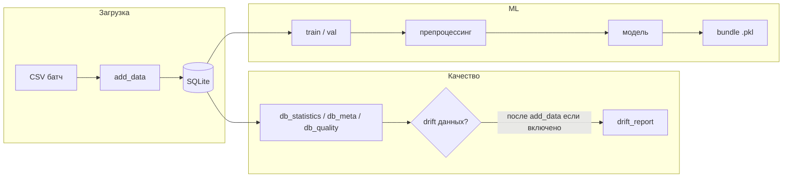

# MLOps Vehicle Insurance Claims

**Дополнительно:** материалы подробнее - в каталоге [`doc/`](doc/).

Проект моделирует потоковую подачу данных: батчи (условно раз в полгода) оказываются в `datasets/` и/или заливаются в SQLite через `run.py --mode add_data`; внешняя доставка сырых CSV на диск может быть вынесена в другой пайплайн.

В качестве эмуляции такого потока исходные данные (Ethiopian Motor Insurance, 2011–2018) разбиты на годовые батчи по колонке `INSR_BEGIN`. Это СЛОЖНЫЙ датасет с реальными, причем zero-inflated данными, поэтому добиться адекватного показателя R2 (> 0.05 мне не удалось). 

| Файл | Строк |
|---|---|
| `datasets/motor_data_2011.csv` | 69 068 |
| `datasets/motor_data_2012.csv` | 91 803 |
| `datasets/motor_data_2013.csv` | 90 943 |
| `datasets/motor_data_2014.csv` | 107 593 |
| `datasets/motor_data_2015.csv` | 116 015 |
| `datasets/motor_data_2016.csv` | 130 412 |
| `datasets/motor_data_2017.csv` | 138 902 |
| `datasets/motor_data_2018.csv` | 57 300 |

Таким образом, каждый файл — это один "прилетевший батч", который подаётся в систему через `--mode add_data` или через изначальный конфиг.

## Структура CLI (`run.py`)

Единая точка входа — **`run.py`**. Режим задаётся **`--mode`**; отдельно без режима используется **`--drift-ref`** (см. пайплайн ниже).

```text
run.py
├── --clear                    очистка session (БД, модели, часть отчётов)
├── --drift-ref                эталон дрейфа данных + перезагрузка из data_sources (без --mode)
├── --mode add_data            потоковый импорт CSV в SQLite + quality (+ опционально drift)
├── --mode analyse             EDA из текущей БД
├── --mode train
│   ├── данные: ровно один из --path-csv | --date-until
│   ├── --new catboost|mlp|auto   новое обучение (auto — эвристика по сырым строкам)
│   └── --old <bundle> | incremental из config   дообучение (не вместе с --new)
└── --mode val
    ├── данные: --path-csv | --date-until
    └── --old <bundle>         оценка сохранённого бандла
```

### Ключи моделей (`--new`)

| Ключ        | Описание |
|-------------|----------|
| `catboost`  | CatBoost регрессор |
| `mlp`       | sklearn `MLPRegressor` |
| `auto`      | выбор `catboost` vs `mlp` по данным (`flexible_model`) |

## Хранилище моделей

Каждая версия — один pickle-бандл (модель + препроцессор + метаданные):

```text
session/models/
└── <model>_<variant>_<timestamp>.pkl
```

Имя без `.pkl` передаётся в **`--old`** для `train` / `val`.

## Структура проекта (`src/`)

| Пакет | Назначение |
|-------|------------|
| **`src/data`** | SQLite, инициализация/стриминг батчей, вспомогательные утилиты; **`quality/`** — статистика, дрейф данных, EDA, пайплайн качества |
| **`src/preprocessing`** | `BasePreprocessor`, сборка матрицы для модели: варианты impute/scale/encode из `config.yaml`, feature engineering по сырым строкам |
| **`src/training`** | **`models/`** — `BaseRegressor`, `CatBoostRegressionModel`, `MLPRegressionModel`, `flexible_model`; **`monitoring/`** — дрейф метрик модели (`model_drift`), опциональный профайлер (`external_profiler` → `session/reports/profiles/`) |

Конкретные классы регрессоров и обёртка обучения живут в **`src/training/models`**, а не в отдельном корневом пакете `models`: **`run.py`** импортирует их оттуда и сохраняет бандл после `train` / `update`.

## Пайплайн от сырых данных до артефакта модели

Ниже — связка шагов в терминах репозитория и `config.yaml`. Порядок типичной работы: данные в SQLite → артефакты качества → (по желанию) EDA → обучение или валидация.



### Конфигурация (`config.yaml`)

- **`data_sources`** — CSV-файлы для первичной инициализации БД (и для режима `--drift-ref`).
- **`columns`** — целевая переменная, дата события, списки числовых и категориальных признаков, id, колонки для отбрасывания.
- **`batch`** — размер потоковой загрузки и сортировка при стриминге в БД.
- **`data_storage`** — пути к SQLite (`session/data/db_sqlite.db`) и YAML со статистикой/метаданными/качеством в `session/reports/`.
- **`quality`** — пороги для отчёта качества, ассоциативные правила (feature engineering на этапе строк), блок **`drift`** (эталон `drift_reference.yaml`, отчёт `drift_report.yaml`, флаг `run_check_after_add_data` и политика `fail_on`).
- **`preprocessing`** — инженерия признаков по сырым строкам (логи, отношения, разности), варианты impute/scale/encode для CatBoost и MLP (`variants`), **`default_variant`**, опция **`tune_preprocess_variants`** (перебор вариантов по validation RMSE при обучении).
- **`training`** — **`validation`**: `holdout` | `kfold` | `time_series`; **`model_drift`** — сравнение метрик train vs текущий `val` и запись `model_drift_report.yaml` / истории; **`profiler`** — опционально время и память (HTML и `manifest.yaml` в `session/reports/profiles/<run>/`).
- **`models`** — гиперпараметры CatBoost и sklearn MLP.
- **`model_storage`**, **`incremental_training`**, **`logging`** — пути к бандлам, дообучение с родителя из конфига, файл лога.

### 1. `add_data` — новый батч в БД

`python run.py --mode add_data --path-csv <файл.csv>` вызывает **`db_add_tables`**: потоковая вставка в таблицу сырых событий, пересчёт глобальной статистики, обновление **`db_quality.yaml`** (и связанных отчётов через quality-пайплайн), при необходимости автоматический EDA. Если в **`quality.drift.run_check_after_add_data`** стоит `true`, после загрузки выполняется **`run_drift_monitor`**: сравнение текущей статистики с **`drift_reference.yaml`** и перезапись **`drift_report.yaml`**. Сам режим **`train`** отчёт дрейфа **данных** не пересчитывает — только цепочка через `add_data` (или ручной вызов quality-пайплайна, как в Docker-примере ниже).

### 2. `--drift-ref` — зафиксировать эталон дрейфа данных

`python run.py --drift-ref` (без `--mode`): внутри **`build_drift_reference`** при необходимости вызывается **`db_clear`**, затем в БД заново заливаются все CSV из **`data_sources`** (`db_add_tables` без полного quality-пайплайна как при обычном `add_data` — в коде отключены `run_quality` / `run_eda` / `run_drift_check` для этого шага), анализатор сохраняет статистику, после чего **`freeze_drift_reference`** копирует её в **`drift_reference.yaml`**. После возврата из `build_drift_reference` **`run.py` снова вызывает `db_clear`** — рабочая `session/` оказывается пустой; команда для «снять снимок эталона и начать чисто». Повседневное сравнение дрейфа данных после `add_data` — через **`quality.drift.run_check_after_add_data`** и **`drift_report.yaml`**.

### 3. `ensure_db` и режимы с БД

Для **`train`**, **`val`**, **`analyse`** вызывается **`ensure_db`**: при отсутствии БД она создаётся из **`data_sources`** в конфиге. Поэтому для обучения по **`--date-until`** нужна уже заполненная база (`add_data` или начальная инициализация).

### 4. `analyse` — EDA по данным из SQLite

`python run.py --mode analyse` строит отчёт (ydata-profiling), путь задаётся в **`quality.eda`** (по умолчанию `session/reports/eda_profile.html`). CSV/`--date-until` для этого режима не используются.

### 5. `train` — матрица признаков, обучение, сохранение бандла

- Источник данных: **ровно один** из вариантов — **`--path-csv`** или **`--date-until`** (фильтр по дате события в SQLite).
- **Новая модель**: `--new catboost` | `mlp` | `auto`. Для **`auto`** по сырым строкам обучающей выборки выбирается семейство (логика в `src/training/models/flexible_model.py`); отдельный флаг в YAML для включения не нужен.
- **Дообучение (incremental)**: либо **`--old <bundle>`**, либо при **`incremental_training.enabled: true`** — родитель из **`incremental_training.parent_model`** в конфиге; с **`--new`** одновременно нельзя.
- Цепочка: загрузка строк и цели → **`build_train_dataset`** (препроцессор `fit`, feature engineering по конфигу, матрица под выбранное семейство) → при **`tune_preprocess_variants`** — перебор вариантов препроцессинга по validation RMSE → **`model.train(...)`** с настройками **`training.validation`** (holdout / kfold / time_series) → pickle в **`session/models/`** с именем `<model>_<variant>_<timestamp>.pkl` (внутри модель + препроцессор + метрики и метаданные).
- В историю метрик (если включён **`training.model_drift`**) после train дописывается запись.

### 6. `val` — оценка сохранённого бандла

`python run.py --mode val --path-csv …` или `--date-until …` **и** `--old <имя_без_pkl>`. Строится валидационная матрица тем же препроцессором из бандла, считаются метрики, при включённом **`model_drift`** — отчёт и политика относительно метрик, сохранённых при обучении.

### 7. `--clear`

Очищает БД и модели из списка в коде очистки (см. `src/data/database/db_clear.py`), в том числе часть отчётов в `session/reports/`.

### Каталог `session/` (рабочие артефакты)

| Путь | Назначение |
|------|------------|
| `session/data/db_sqlite.db` | SQLite с сырыми JSON-событиями |
| `session/reports/db_statistics.yaml`, `db_meta.yaml`, `db_quality.yaml` | Статистика и контракт признаков для препроцессинга |
| `session/reports/drift_reference.yaml`, `drift_report.yaml` | Эталон и отчёт дрейфа **данных** |
| `session/reports/model_drift_report.yaml`, `model_metrics_history.yaml` | Дрейф **метрик модели** и история |
| `session/reports/eda_profile.html` | EDA |
| `session/reports/profiles/` | Профайлер: подпапка на прогон + `manifest.yaml` |
| `session/models/*.pkl` | Бандлы модель + препроцессор |
| `session/logs/run.log` | Логи `run.py` |


## Базовый синтаксис

```bash
python run.py --mode <train|val|add_data|analyse> [опции]
```

## Логи

`run.py` пишет служебные сообщения и ошибки в `session/logs/run.log`.

## Примеры использования

```bash
# Загрузить новый батч данных в БД
python run.py --mode add_data --path-csv datasets/motor_data14-2018.csv

# Обучить новую CatBoost модель
python run.py --mode train --path-csv datasets/motor_data14-2018.csv --new catboost

# Выбор catboost vs mlp по эвристике на сырых train-строках
python run.py --mode train --path-csv datasets/motor_data_2011.csv --new auto

# Дообучить уже сохранённую модель на новых данных (без обучения с нуля)
python run.py --mode train --date-until 2012-12-31 --old catboost_catboost_ord_20260419_233941

# Оценить сохранённую модель
python run.py --mode val --path-csv datasets/motor_data14-2018.csv --old catboost_20260321_171846

# Очистить БД
python run.py --clear

# Зафиксировать эталон дрейфа данных (перезаливка из data_sources в конфиге, затем очистка session)
python run.py --drift-ref
```

## Установка

Последнее время балдею с [uv](https://github.com/astral-sh/uv). Создадим виртуальную среду с Python 3.10 и установим зависимости:

```bash
uv venv .venv --python 3.10
source .venv/bin/activate      # или .venv\Scripts\activate
uv sync --locked
```

## Docker workflow

Для локальной Docker-ветки используется `Dockerfile`. Образ использует Python 3.10, как указано в `.python-version`, и собирает окружение через `uv sync --locked` по `pyproject.toml` и `uv.lock`, поэтому версии зависимостей фиксируются lock-файлом.

Сборка образа:

```bash
docker build -t vehicle-claims-mlops .
```

Подготовка данных и quality-артефактов:

```bash
docker run --rm \
  -v "$PWD/datasets:/app/datasets:ro" \
  -v "$PWD/session:/app/session" \
  vehicle-claims-mlops \
  python -m src.data.quality.pipeline
```

Запуск обучения CatBoost внутри контейнера:

```bash
docker run --rm \
  -v "$PWD/datasets:/app/datasets:ro" \
  -v "$PWD/session:/app/session" \
  vehicle-claims-mlops \
  python run.py --mode train --date-until 2012-12-31 --new catboost
```

Подготовку нужно выполнить перед обучением в чистой `session/`, потому что train использует `session/reports/db_quality.yaml` как контракт набора признаков. Если артефакты уже подготовлены, этот шаг можно пропустить.

Контейнер ожидает, что данные лежат в локальной папке `datasets/`, а рабочие артефакты пишутся в примонтированную папку `session/`. После запуска без захода в контейнер доступны:

- логи обучения: `session/logs/run.log`;
- SQLite-база и отчеты: `session/data/`, `session/reports/`;
- сериализованные модели: `session/models/*.pkl`.

### Docker Compose (`compose.yaml`) — альтернатива длинному `docker run`

В репозитории есть **`compose.yaml`** с сервисом **`dev`**: образ собирается из того же `Dockerfile`, рабочая директория `/app`, в контейнер монтируется **весь текущий каталог проекта** (``.` → `/app`), при этом анонимный том **`/app/.venv`** не даёт локальной папке `.venv` затереть виртуальное окружение, установленное при сборке образа. Удобно для интерактивной отладки: правки на хосте сразу видны внутри контейнера.

Сборка образа (из корня репозитория):

```bash
docker compose build
```

Интерактивная оболочка в том же окружении, что и образ (запуск из корня репозитория):

```bash
docker compose run --rm dev bash
```

Внутри контейнера `PYTHONPATH=/app` уже выставлен в `compose.yaml`; команды можно запускать так:

```bash
python run.py --mode train --path-csv datasets/motor_data_2011.csv --new catboost
# или одноразовый запуск без входа в shell:
docker compose run --rm dev python run.py --mode val --path-csv datasets/motor_data_2011.csv --old <имя_бандла>
```

Если нужен полный quality-пайплайн до обучения (как в примере выше с `python -m src.data.quality.pipeline`), его так же можно выполнить внутри `dev`:

```bash
docker compose run --rm dev python -m src.data.quality.pipeline
```

Комментарии в начале `compose.yaml` дублируют эквивалентные вызовы «голого» `docker build` / `docker run` с теми же томами — их можно скопировать в shell-алиас под свою машину.

### Локально без ручного `activate`: `uv run`

Если зависимости уже синхронизированы (`uv sync --locked`), те же команды можно не активируя venv явно:

```bash
uv run python run.py --mode add_data --path-csv datasets/motor_data_2011.csv
uv run python run.py --mode train --date-until 2012-12-31 --new mlp
```

Такой способ эквивалентен запуску из активированного `.venv`, но удобен в CI и в однострочных скриптах.

## Аргументация подхода

В качестве подхода к развертыванию был выбран Docker, так как он позволяет зафиксировать окружение проекта, упростить запуск системы на любом устройстве и обеспечить воспроизводимость результатов. Я предпочет его GitHub Actions, так как в рамках данного учебного проекта посчитал это более ценным опытом.